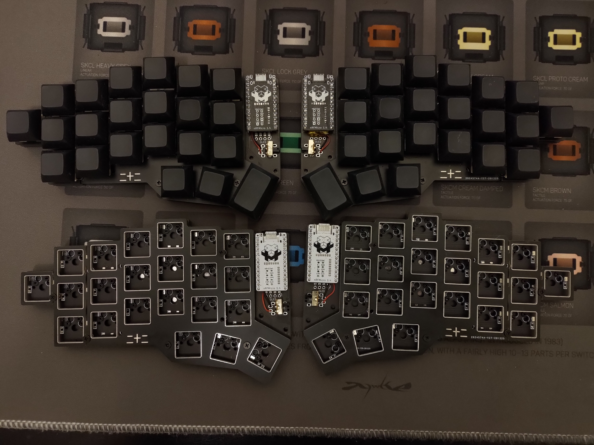

# Nijuni

The Nijuni (formerly known as the RT-22) is a 44-key split keyboard inspired by the [Jian](https://github.com/KGOH/Jian-Info) (stagger, pinky and controller footprint) and the 
[Jorne](https://github.com/joric/jorne) (thumb cluster and wiring).

It was originally conceived by [DwarZ](https://t.me/rafworksintl), however, V0.1 had a screw placement issue that restricted it to Kailh BOX-style switches.
V0.2 is trouble-free, and prototypes have already been tested.

## Features

* Wireless focus - battery footprint, power switches and no LEDs in sight
* Uses Jorne firmware - so QMK and ZMK support
* MX or Alps soldered or MX hotswap support in a single reversible PCB
* 6 column version also available for 100x150 PCB promos.

## Download

You can download Gerber and DXF files in the [releases section](https://github.com/krikun98/jorian840/releases).
More images are also in Actions builds.

## Instructions

### Firmware

The Nijuni is fully pin-compatible with the Jorne (and the 6 column version is compatible with the Corne), so both ZMK and QMK support it already.

### BOM/Build instructions

The Nijuni is not that different to a regular Jorne, so please refer to [Joric's wonderful wiki](https://github.com/joric/jorne/wiki) for all the instructions.

The only major difference is the controller footprint.
The Jian has a [build guide](https://telegra.ph/Gajd-po-sborke-Jian-12-08) in Russian, but the pictures should be easy enough to follow along with.

An older version of the controller footprint had a problem: the solder could flow through and short something on top.
This should not happen anymore, as the holes were shrunk down to accept spring pin headers, but if it still does - please file an issue.

## Links

### Version 0.2

Full 7-column PCB

[IBOM](https://htmlpreview.github.io/?https://github.com/krikun98/nijuni/blob/main/pcb/pinky/bom/ibom.html)

[gerbers](../../releases/latest/download/pcb_pinky_gerbers.zip)

front|back
--|--
|

6-column version

[IBOM](https://htmlpreview.github.io/?https://github.com/krikun98/nijuni/blob/main/pcb/solder/bom/ibom.html)

[gerbers](../../releases/latest/download/pcb_6col_gerbers.zip)

front|back
--|--
|

[Case gerbers](../../releases/latest/download/gerber_case_files.zip)

[Case files for laser cutting](../../releases/latest/download/laser_case_files.zip)

All the case files labeled "plastic" have the switch holes adjusted(0.25 mm. smaller in both dimensions).
If your laser cutter has different tolerances - adjust them and re-run the build script.